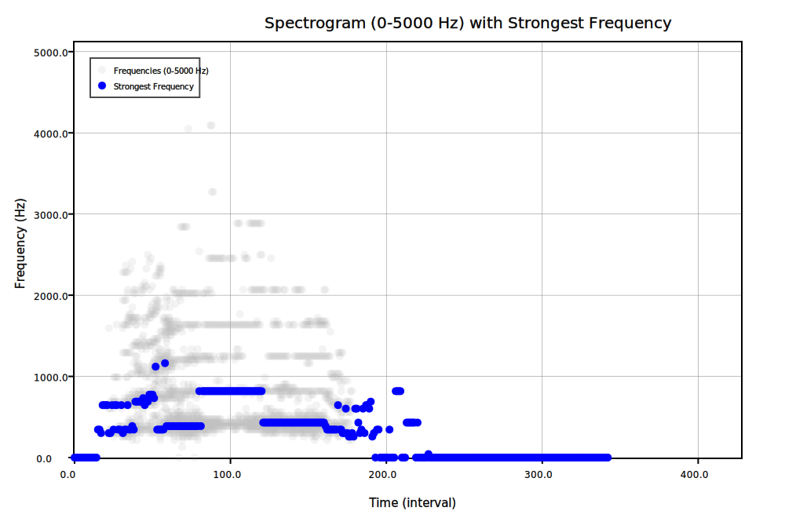

# SwiftSound 🔊

[](https://swiftpackageindex.com/mesqueeb/SwiftSound)
[](https://swiftpackageindex.com/mesqueeb/SwiftSound)

```
brew install mesqueeb/tap/fft
```

An Experimental Swift CLI for FFT Analysis

## Overview

This repository was created as an **experiment to explore sound analysis** using Swift. Through this project, I aimed to understand **how sound works, how it is stored digitally, and how we can visualize it using techniques like Fast Fourier Transform (FFT).** The journey covered everything from **raw audio amplitude extraction to spectrogram generation**.

This tool reads audio files (including `.mp3`, `.wav`, `.flac`, and `.raw`) and processes them into **raw amplitude arrays** and **spectrograms**, while supporting **file format conversion** via SoX and generating **FFT visualizations**.

### Complete Example

A complete example is located at [examples](./examples/):

1. We started with [elephant.flac](./examples/elephant.flac)
2. It gets converted into [elephant_flac.raw](./examples/elephant_flac.raw)
3. The raw file is then converted to raw amplitude values visible at [elephant_raw_amplitudes.json](./examples/elephant_raw_amplitudes.json)

   ```json
   [0.0018920898,0.0014038086,0.001739502,0.0013427734,0.0008544922,0.0007324219,-0.00012207031,-0.00036621094,-0.00048828125,-0.00076293945,-0.00033569336,-0.00088500977,0.00012207031,-0.00039672852,0.0004272461,-0.00021362305,0.00021362305,-0.00021362305,0,-0.0005187988,3.0517578e-05,-0.00039672852,0.00015258789,-0.0005493164,0.00091552734,6.1035156e-05,0.0014038086,0.00076293945,0.0013427734,0.00076293945,0.00061035156,0.00033569336,9.1552734e-05,-0.00021362305,-0.00018310547,...]
   ```

4. The raw amplitude values are then converted into a spectrogram at [elephant_spectrogram.svg](./examples/elephant_spectrogram.svg)

   

## 🛠️ How to Use

### Usage Overview

```
OVERVIEW: A Swift command-line tool for FFT analysis.

USAGE: fft <input-file> [--json] [--svg] [--open] [--output <output>] [--sample-rate <sample-rate>] [--max-frequency <max-frequency>] [--verbose]

ARGUMENTS:
  <input-file>            The path to the raw or audio file.

OPTIONS:
  --json                  Save the extracted raw amplitude as JSON.
  --svg                   Save an SVG spectrogram to a file.
  --open                  Open the SVG in Preview.
  -o, --output <output>   Output SVG spectrogram filename.
  -s, --sample-rate <sample-rate>  (default: 44100.0)
  -m, --max-frequency <max-frequency> (default: 1000.0)
  -v, --verbose           Enable verbose output.
  -h, --help              Show help information.
```

### Use Case Examples

1. **Convert and Analyze a `.mp3` File:**

   ```bash
   swift run fft elephant.mp3 --json --svg --open --verbose
   ```

2. **Analyze a `.wav` File and Save JSON Only:**

   ```bash
   swift run fft sound.wav --json
   ```

3. **Create an SVG Spectrogram with Custom Sample Rate:**
   ```bash
   swift run fft music.flac --svg --sample-rate 48000 --max-frequency 5000
   ```

### Build from Source

```bash
git clone https://github.com/mesqueeb/SwiftSound.git
cd SwiftSound
brew install sox
swift build
swift run fft <input-file> [options]
```

### Use the Swift code in your project

```
.package(url: "https://github.com/mesqueeb/SwiftSound", from: "1.0.3")
```

```swift
import SwiftSound

let result = stft(samples: [/** ... */], sampleRate: 44100.0)

print("result:", result)
```

## 📚 What I Learned About Sound

### 🧩 **The Building Blocks of Sound:**

- **Frequency (Pitch):** The speed of air vibrations, measured in Hertz (Hz). Higher frequency = higher pitch.
- **Amplitude (Gain):** The strength of the wave (how loud it is).
- **Timbre:** The unique fingerprint of a sound, which is a combination of:
  - **Harmonics:** Additional frequencies layered on top of the fundamental pitch.
  - **ADSR (Envelope):** The Attack, Decay, Sustain, and Release profile of a sound.
  - **Noise Characteristics:** Subtle imperfections or unique textures that distinguish sounds.

### 🎨 **How Sound Becomes Data:**

- **Sampling:** Measuring sound waves thousands of times per second (e.g., 44100 samples/sec).
- **Fourier Transform:** Breaking a complex wave into simple frequencies (FFT analysis).
- **Spectrograms:** Visualizing sound as time vs. frequency vs. amplitude.

### 🛠️ **Key Technical Lessons:**

- **File Formats:** `.raw` is uncompressed samples, while `.mp3`, `.wav`, and `.flac` compress audio differently.
- **SoX Integration:** Using `sox` can convert between audio formats and sample rates.
- **FFT Analysis:** FFT stands for Fast Fourier Transform, which converts sound waves into frequency components.
- **STFT Analysis:** STFT stands for Short-Time Fourier Transform, which breaks sound into time slices on which FFT is applied, resulting in a spectrogram of frequencies over time.
- **SVG Rendering:** Visualizing STFT results with `SwiftPlot`.

## ❤️ Why I Built This

This project started from a simple question: **“What is sound?”** and became a deep dive into **audio analysis, signal processing, and digital representations of sound.** It also became an exploration of how Swift can be used for scientific computation.

I hope this experiment inspires others to explore the **intersection of programming, science, and art**. 🎶💻✨

Feel free to fork this project, contribute, or reach out with suggestions!

**Author:** Luca Ban  
**GitHub:** [mesqueeb](https://github.com/mesqueeb)
